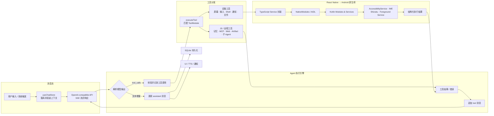

# YSClaude

YSClaude 是一个 Android 优先的个人 AI Agent 工作台。它以对话为入口，将大模型推理、工具调用、长期记忆、子 Agent、自动化工作流与 Android 系统能力组织成一个可持续运行的移动端 Agent Runtime。

项目并非简单的 Chat UI：模型可以在多轮执行循环中搜索记忆、操作网页、读写 Artifact、调用 MCP Server、派发子 Agent，并通过 Kotlin 原生模块观察和控制 Android 设备。

## 技术栈

- **应用框架**：React 19、React Native 0.85、Expo SDK 56、Expo Router、TypeScript 6
- **状态与数据**：Zustand、Expo SQLite、File System
- **Agent 能力**：OpenAI-compatible Chat Completions、Function Calling、MCP、Prompt Cache
- **实时通信**：LiveKit、WebRTC、STT / LLM / TTS 流水线
- **Android 原生层**：Kotlin、React Native NativeModules、AIDL、AccessibilityService、InputMethodService、Shizuku

## 质量保障

项目使用 Vitest 验证可独立运行的协议与工具调用逻辑，并通过 GitHub Actions 在 push 和 pull request 时执行类型检查与单元测试。

```bash
npm run typecheck
npm test
npm run test:coverage
```

当前自动化用例覆盖 SSE 分片与损坏事件、工具调用增量兼容、Agent Loop 停止条件、子 Agent 并行策略和异常参数降级。人工测试范围与准入标准见 [`docs/testing/test-cases.md`](docs/testing/test-cases.md)，真实回归案例见 [`docs/testing/real-defect-cases.md`](docs/testing/real-defect-cases.md)，缺陷记录可复用 [`docs/testing/bug-report-template.md`](docs/testing/bug-report-template.md)。

## 整体架构



## 核心技术难点

### 1. Agent 执行引擎

Agent 主循环位于 `src/stores/chat.ts`。它负责把模型、消息、工具和 UI 状态组织成一个可中断、可追踪的执行过程：

```text
构造稳定 Prompt、历史消息和运行时上下文
  → 发起流式 Chat Completion
  → 实时写入文本和 Thinking 内容
  → 收集并重组 tool_calls
  → 执行工具并生成 tool message
  → 携带执行结果继续请求模型
  → 无工具调用、用户中止或达到调用上限后结束
```

#### 有界循环

不同工具的合理调用深度不同。引擎根据当前启用能力动态计算本轮上限，例如记忆检索、MCP、网页交互、远程命令和 Android 控制分别提供自己的 `maxToolCalls` 配置。循环同时记录累计调用次数，避免模型陷入无限工具调用。

每轮 `tool_calls` 会以 assistant 消息写回上下文，执行结果则按 OpenAI 协议附带 `tool_call_id` 追加为 tool 消息，从而维持完整的因果链。工具调用状态还会同步到 `ToolInvocation`，支持 UI 实时展示和历史回放。

#### 并行与顺序语义

普通工具默认串行执行，避免文件读写、页面操作等工具之间的隐式依赖被破坏。当同一批调用全部为 `dispatch_subagent` 时，任务彼此独立，引擎使用 `Promise.all` 并行运行，但仍严格按照模型返回顺序写回结果，保证上下文稳定。

子 Agent 具有独立的 System Prompt、模型配置、工具白名单、MCP 权限、最大工具次数和递归深度。父级 `AbortSignal` 会向子 Agent 传播，用户停止生成时可以终止整棵执行链；运行过程则写入 `agent_runs` 与 `agent_run_events`，便于恢复和诊断。

#### 上下文与结果控制

- 历史消息分页读取，并支持隐藏区间和定点打开，避免一次加载全部会话。
- 工具结果可按 Token 估算触发压缩，原始结果仍保留在本地供展开查看。
- Thinking、工具调用和最终文本使用不同展示结构，不把执行细节混入普通正文。
- 每次请求记录耗时、状态、Token、缓存命中量和错误信息，形成可观测的 API 使用事件。

### 2. Prompt 缓存优化

Prompt Cache 的关键不只是添加 `cache_control`，而是保持缓存前缀稳定。YSClaude 将请求拆成三段：

```text
[稳定 System Prompt + 可复用历史消息] [缓存断点] [本轮动态上下文与最新输入]
```

`buildRequestMessages` 只在稳定前缀的最后一个有效文本块上标记缓存断点。时间、前台应用、网页状态等高频变化信息放在 suffix 中，防止动态字段导致整段 Prompt 的缓存键失效。

兼容层根据供应商调整协议：标准模式使用消息内容块的 `cache_control`；兼容模式额外写入 `promptCaching` 参数，并在一小时 TTL 下发送对应的 Anthropic Beta Header。API 返回的 `cached_tokens` 会被统一归一化并写入用量统计。

对于需要长时间保留的会话，应用支持远程缓存保活：

- 成功请求后生成最新会话快照，而不是从 UI 状态重新拼接近似请求。
- 快照同步采用五分钟 debounce、单一 in-flight 请求和有界等待队列，合并短时间内的频繁变化。
- 服务端使用无输出 keepalive 消息刷新缓存；客户端跟踪 queued、syncing、synced 和 failed 状态。
- 网络失败不会阻塞正常聊天，待同步快照保留并在后续重新调度。

### 3. 流式协议容错

`src/services/api.ts` 对 OpenAI-compatible SSE 流进行增量解析。网络分片不保证与 UTF-8 字符、SSE 行或 JSON 对象边界对齐，因此实现采用 `TextDecoder({ stream: true }) + 残留 buffer`：只消费完整行，未完成部分留到下一数据块，流结束后再执行一次 flush。

解析器对空行、非 `data:` 行、`[DONE]` 和损坏 JSON 采取跳过策略，单个异常事件不会中断整条回复。同时保存 `finish_reason` 与 usage 数据，并使用 `AbortSignal` 区分用户取消和真实请求失败。

工具调用比普通文本更复杂：不同兼容服务可能按 index、id 或数组位置发送分片，甚至把函数名和 JSON 参数拆在多个 delta 中。实现会：

1. 根据显式 index、调用 id、当前位置和上一调用位置解析目标调用。
2. 分别增量合并函数名与 arguments，防止未完成 JSON 被提前解析。
3. 使用当前工具集合校验名称，修复部分供应商将多个工具名拼接到同一调用的问题。
4. 在流结束后统一展开和过滤有效调用，再交给 Agent Loop 执行。

Reasoning 兼容层同时识别 `reasoning_content` 与 `reasoning`，在流中补齐 `<thinking>` 边界；正文开始或连接结束时主动闭合标签，避免异常响应破坏消息渲染。

### 4. Android 原生模块（Kotlin）

Expo/React Native 负责跨平台 UI，Android 特有能力集中在 `android/app/src/main/java/com/ysclaude/app/`。Kotlin 模块通过 `AndroidSystemToolsPackage` 注册到 React Native，TypeScript 侧再由 `src/services/` 进行平台检查、权限处理和结果归一化，业务组件不直接依赖原生 API。

#### 屏幕观察与交互

设备控制优先使用可访问性节点树，而非不稳定的绝对坐标。屏幕快照会生成带稳定路径的交互节点，模型可按节点执行点击、滚动和文本输入；只有无法获得可操作节点时才降级到坐标操作。

`YSClaudeInputMethodService` 提供专用 IME 通道，用于向当前输入连接提交文本、执行编辑器动作和删除文本，解决 Accessibility `ACTION_SET_TEXT` 在部分应用中不可用的问题。

#### Shizuku 与 AIDL

`ShizukuShellModule` 负责权限检查和 React Native Promise 桥接，实际 Shell 运行在 `ShizukuShellUserService` 中，两者通过 AIDL Binder 通信。连接过程处理 service disconnected、binding died、null binding 和连接超时；命令执行还设置超时与最大输出长度，防止高权限进程长期占用资源或向模型注入过量上下文。

这一通道可完成本机 Shell、截图、输入法切换和部分设备动作。权限必须由用户显式授予，AI 工具还受独立设置开关和调用次数上限约束。

#### 后台生命周期

项目使用不同的 Foreground Service 隔离长期任务：

- `FloatingBallForegroundService`：悬浮球与屏幕采集。
- `VoiceCallForegroundService`：实时音视频通话。
- `BotForegroundService`：外部消息渠道保活。
- `AIWorkflowKeepAliveService` / Headless JS Task：定时与事件触发工作流。

原生服务只维护 Android 生命周期和系统资源，具体 Agent 逻辑仍回到 TypeScript 层执行，避免在 Kotlin 与 JS 中维护两套业务状态机。

### 5. 模块化工具体系

工具系统以 `ToolModule` 为最小扩展单元：

```ts
interface ToolModule {
  id: string;
  labels: Record<string, string>;
  getDefinitions(config): ToolDefinition[];
  execute(name, args, context): Promise<ToolExecutionResult | undefined>;
}
```

每个模块同时负责两件事：根据运行时配置暴露模型可见的 JSON Schema，以及识别并执行自己负责的工具。`getToolDefinitions` 使用 `flatMap` 聚合启用模块；`executeTool` 顺序询问模块并在首个命中后返回。新增工具不需要修改中央 switch，只需注册一个模块。

`ToolExecutionContext` 统一传递会话 ID、消息 ID、各工具配置、子 Agent 深度和 `AbortSignal`。工具异常在分发边界被转换为稳定结果，保证单个工具失败不会直接击穿 Agent Loop。

当前工具域包括：

- 本地记忆的向量与关键词检索、日记写入。
- MCP tools 与 resources 的动态发现和远程调用。
- 网页搜索、WebView 观察及页面交互。
- 对话 Artifact 的读写、版本管理和远程传输。
- 子 Agent 派发、用户追问卡片与消息 Reaction。
- Android 日历、联系人、短信、设备信息、屏幕控制和 Shizuku Shell。
- QQ、微信 ClawedBot、Discord 等外部消息渠道。

MCP 工具使用命名空间编码服务端与工具名，避免不同 Server 的同名冲突。子 Agent 的工具池与主 Agent 的启用状态分离，再通过白名单裁剪，实现按 Agent 配置的最小权限暴露。

## 数据与状态设计

业务状态按领域拆分为 Zustand Store，结构化数据写入 Expo SQLite，设置类状态使用 SQLite KV Storage 持久化。数据库包含会话、消息、记忆、阅读、专注、日历、API 用量、Artifact 和 Agent Run 等数据表。

数据库初始化由共享的 in-flight Promise 保护，避免冷启动时多个 Store 同时访问引发建表竞态。Schema 使用 `PRAGMA user_version` 维护增量迁移，并辅以列存在检查，使全新安装和跨版本升级可以走同一套迁移代码。

## 项目结构

```text
.
├── app/                         # Expo Router 页面与路由
├── src/
│   ├── components/              # 聊天、工具调用及通用 UI
│   ├── db/                      # SQLite 初始化、迁移与 CRUD
│   ├── services/
│   │   ├── api.ts               # 流式协议与兼容层
│   │   ├── tools.ts             # 工具注册与分发
│   │   ├── toolModules/         # 独立工具模块
│   │   ├── subAgentRuntime.ts   # 子 Agent 执行循环
│   │   └── promptCacheKeepalive.ts
│   ├── stores/                  # Zustand 业务状态与主 Agent Loop
│   └── types/                   # 核心领域类型
├── android/                     # Kotlin 模块、Service、AIDL 与 Widget
├── assets/                      # 图标、图片和字体
├── app.json                     # Expo、权限与原生插件配置
└── eas.json                     # EAS 构建配置
```

## 其他能力

- LiveKit Agents 实时语音/视频通话，支持字幕、打断与状态同步。
- 本地长期记忆、日记、日报、阅读、高亮、专注、日历与记账。
- HTML Artifact、对话文件版本管理与 SSH 远程文件传输。
- 可配置工作流、后台触发器、通知主动触达与桌面小组件。
- API 用量、Token、缓存命中、耗时、错误与成就统计。

## 开发

```bash
npm install
npm run typecheck
npm run android
```

项目包含 Kotlin 原生模块，设备控制、前台服务和 LiveKit 原生能力需要使用 Development Build 或 Android 原生构建，不能在 Expo Go 中运行。

## License

本项目采用 [PolyForm Noncommercial License 1.0.0](LICENSE)。未经额外商业授权，不得将本项目或其修改版本用于商业用途。

Copyright © 2026 YSClaude contributors.
